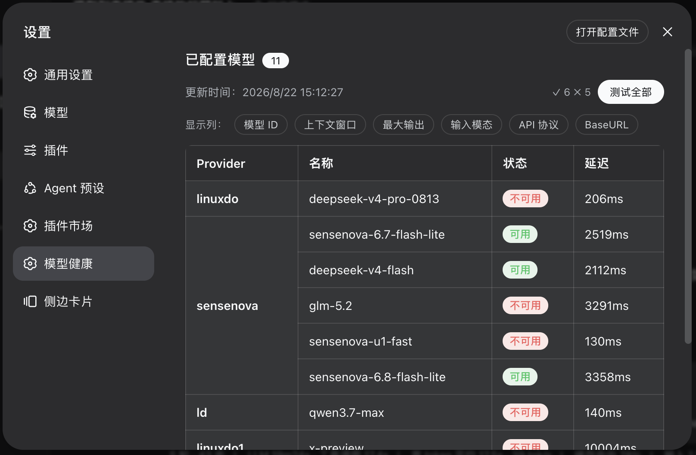

# dsh-model-health

[](https://www.npmjs.com/package/dsh-model-health)
[](#license)

> DeepSeek Harness (DSH) 插件：在设置页提供「模型健康」面板——列出所有已配置模型，并一键批量测试可用性与延迟。
>
> 中文 ｜ [EN](README_EN.md)



## 安装 / Install

### npm 安装（推荐）

```sh
dsh plugin --profile web add dsh-model-health
```

### 源码安装

```sh
git clone https://github.com/oxlyn/dsh-model-health.git
cd dsh-model-health
pnpm install
pnpm run build        # tsdown → dist/index.js (ESM) + dist/client.js (IIFE)

# 在插件的父目录执行（dsh plugin add 的相对路径锚定调用目录）：
cd ..
dsh plugin --profile web add ./dsh-model-health
dsh web
# 启动日志应出现：[dsh-model-health] ready — tool "list_models" + routes GET /api/model-health/json, POST /api/model-health/test
```

### 验证 / Verify

安装后打开 `dsh web` → 设置 → 模型健康，应能看到已配置模型表格。无 API key 也可验证插件加载：

```sh
dsh --profile web --dump-config | grep dsh-model-health   # 配置层含本行
```

## 功能 / Features

读取 `$DSH_HOME/settings.yaml`（默认 `~/.dsh/settings.yaml`），提供三种使用方式：

| # | 形式 | 入口 | 说明 |
|---|------|------|------|
| 1 | 「模型健康」面板 | Web UI → 设置 → 模型健康 | React 表格：Provider / 模型 ID / 名称 / 上下文窗口 / 最大输出 / 输入模态 / API 协议 / BaseURL，可选列可切换显示 |
| 2 | 测试全部 | 面板内「测试全部」按钮 | 并发（上限 6）对每个模型发一次 `max_tokens=1` 的最小 chat completions 请求，10s 超时；逐行显示 可用 / 不可用 / 跳过 / 延迟，失败原因悬停查看，结果持久化到 localStorage。已出结果的徽章可点击，单独重测该模型（悬停显示下划线） |
| 3 | Tool 插件 `list_models` | 对话中调用 | 返回 Markdown 表格，供模型在对话中查看模型清单 |

**特性一览：**

- 支持 `llm-pi-ai`（多协议自定义提供商）与 `llm-deepseek`（官方）两类配置来源
- 可用性测试支持 `openai-completions` 与 `deepseek` 协议，其余协议自动标记「跳过」
- API Key 通过 DSH credential service（`ctx.credentials.resolve`）解析，密钥不会输出到浏览器
- 测试结果（状态/延迟/错误）持久化到 localStorage，刷新页面后仍可见
- 状态列的 可用 / 不可用 / 跳过 徽章随时可点击，对单个模型重新测试，原地刷新状态与延迟

## 实现方式 / How it works

插件分为 host 侧与 client 侧两部分（`package.json` 的 `dsh.client` 字段声明 client 入口）：

```
┌─ host 侧  src/index.ts → dist/index.js ─────────────────────────┐
│  - ctx.tools.register：注册 list_models 工具（Markdown 表格输出） │
│  - ctx.webServer.register：                                        │
│      GET  /api/model-health/json  读取并解析 settings.yaml → JSON  │
│      POST /api/model-health/test  对单模型发最小请求测可用性/延迟  │
│  - 解析 DSH credential service 获取 API Key                        │
└──────────────────────────────────────────────────────────────────┘
                          │ fetch
┌─ client 侧 src/client.tsx（TSX，浏览器端模块）────────────────────┐
│  - 通过 settings.section slot 注入「模型健康」面板                  │
│  - React（宿主提供）渲染表格 + 状态徽章 + hover 错误提示            │
│  - 「测试全部」：worker pool 限并发 6，逐个更新行状态               │
└──────────────────────────────────────────────────────────────────┘
```

技术要点：纯 ESM（`"type": "module"`）、cordis 作为 peerDependency 由宿主提供（仅编译期 import type）、服务依赖通过 `export const inject = ['tools', 'webServer', 'credentials']` 声明。

## 环境要求 / Requirements

- Node `^22.19.0 || >=24.0.0`（DSH 宿主要求）
- pnpm（源码构建用）

## 开发 / Development

```sh
pnpm install
pnpm run typecheck   # 类型检查
pnpm run build       # 构建 dist/
```

项目结构：

```
dsh-model-health/
├── src/index.ts            # host 入口：tool + HTTP 路由接线
├── src/host/               # host 实现：config / models / markdown / http / model-test
├── src/client.tsx          # client 入口壳：注入 React，装配插件导出
├── src/client/             # client 实现：types / runtime / i18n / storage / api /
│                           #   styles / columns / use-test-results / apply
│   └── components/         # ModelListSection / StatusCell / ErrorTooltip
├── cordis.patch.yml        # bundle 层声明（id/name 走包名解析）
└── dist/                   # 构建产物（发布包含在 files 字段中）
```

## 依赖锁定 / Dependencies

- `@deepseek-ai/dsh-tools`: `0.1.0-rc.8` (exact — the **`next`**-tag line; npm `latest` is stale).
- `@deepseek-ai/cordis`: `^4.0.1` (peerDependency — host provides it; types-only in code).

## 友情链接 / Links

- [LinuxDo](https://linux.do)

## License

[MIT](LICENSE)
